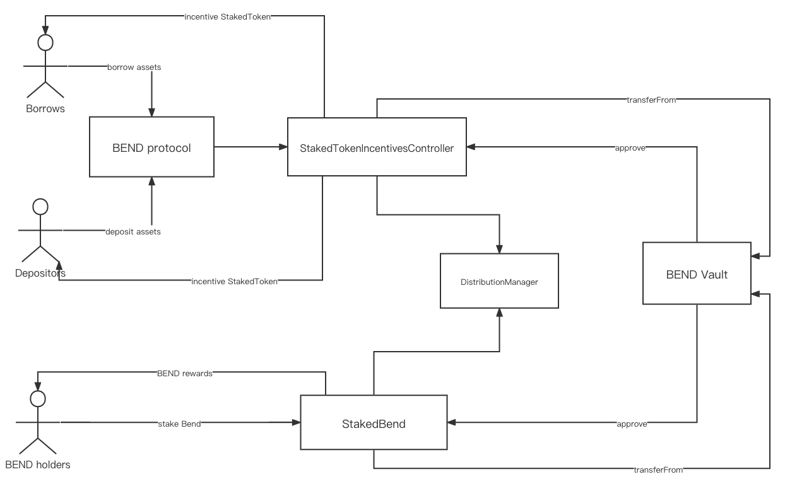
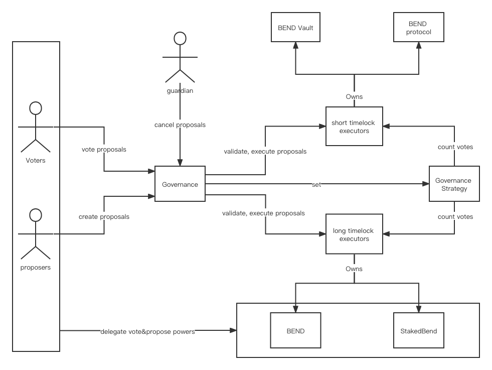

# nftlend-stake

## Incentive Architecture

bend 将激励三种行为
1. bend 持有人将bend锁定在抵押池
2. 存款人为 bend protocal 提供流动性
3. 借款人在 bend 协议中借款

StakedBend, StakedTokenIncentivesController共同继承自DistributionManager，共享了配置和分配计算模型, BEND 金库会提前授权给它们，以便从中提取资金

## DistributionManager
通过使用一个分配指数来计算某个用户的奖励，该指数随着时间更新，代表奖励的积累。每个用户拥有独立的指数，以确定具体用户的奖励金额

## StakedBend
负责保护流动性提供者免受资金损失的风险（清算和智能合约风险），保护协议免于破产，为了促进协议的安全并获得奖励，BEND 持有人在该合约中抵押代币，从而获取BEND奖励，一旦积累了奖励，他们可以在任何时候提取，但是需求提前激活一个冷却周期，并等待冷却周期过后，在一个提取时间窗口内提取

### 冷却周期

### StakedBendIncentivesController
每次在bend协议中发生任何涉及到对用户激励的行为（存款，借款），都会调用这个合约来更新激励状态。

## Governance Architecture

完全链上的治理协议，BEND及stkBEND持有人通过提案，投票，执行参与治理，这确保了协议能够迅速适应不断变化的市场条件，并随着时间的推移升级协议的核心部分。

### 治理权
BEND/stkBEND持有人按其余额的比例获得治理权力。
1. 提案权，用于创建和维持一个提案
2. 投票权，用于投票支持或反对现有的提案。
任何用户都可以选择委托与一个代币相关的一个或两个治理权力。
收到委托权力的用户不能将该委托权力转给另一个被委托人，委托的权力不能进一步传递。

#### 提案/投票
1. 账户在某一区块的提案/投票权等于该账户的BEND/stkBEND余额加上所有委托人的余额的快照。
2. 账户的余额对提案权和投票权都有影响，而委托人可以选择将提案权、投票权或两者都委托给其他账户。
3. 提案创建者必须在提案创建前的区块拥有高于PROPOSITION_THRESHOLD的提案权，直到提案被执行。
4. 一个用户只能投票一次，这个投票的权重等于调用submitVote()时用户在该区块的投票权。
   

提案的类型分为两种
1. 更新bend协议及BEND金库中需要快速干预部分的提案，由short timelock executor执行
2. 更新bend协议中影响治理共识的部分的提议，由long timelock executor 执行

#### 提案的流程
1. 提案创建
  提案可以通过调用create()来创建，但有以下几点注意事项。
  提案人的提案权必须高于PROPOSITION_THRESHOLD.在提案实际执行钱，提案人需要保持提案权的阈值，在投票开始之前，该提案现在处于待定状态。

2. 提案投票
  如果 votingDelay = 0，那么投票期从下一个区块开始。否则投票在 votingDelay 之后开始，votingDelay的值可以从getVotingDelay()中获取。
  投票权的在投票时会快照，对于正在投票的提案，投票权就不能再进行委托/转让了。
  一旦提案的状态变为ACTIVE，用户就可以在VOTING_DURATION时间内，对该提案的投票支持或反对（根据用户的总投票权（代币+委托的投票权））。

3. 投票期结束
    提案通过需要以下条件：
    
    1. 赞成票的投票权（占总投票权的%）需要达到MINIMUM_QUORUM参数设定的法定人数
    
    2. 赞成票和反对票的差额（占总投票权的%）需要超过VOTE_DIFFERENTIAL参数设定的投票差额阈值
    
    如果提案通过了，那么提案状态就变成SUCCEEDED，否则就是FAILED。
    
4. 提案排队和执行
    一个SUCCEEDED的提案将进入待执行队列，将在执行延迟后和宽限期到期前被执行。延迟可以从getDelay()获取，GRACE_PERIOD可以从GRACE_PERIOD()获取。
    提案的验证和执行是由timelock executor来完成
    
    状态的流转：
    
    1. 排队提案状态是QUEUED。
    2. 成功执行的提案的状态是EXECUTED。
    3. 如果一个排队的提案在到期前没有被执行，那么提案的状态是EXPIRED。
    
5. (可选）提案取消
    如果提案创建者的提案权下降，不再满足PROPOSITION_THRESHOLD，任何用户都可以取消提案。
    此外，作为协议的初始保障，由bend团队控制的监护人账户（guardian）能够在提案执行前取消提案。
    被取消的提案的状态是CANCELED。

